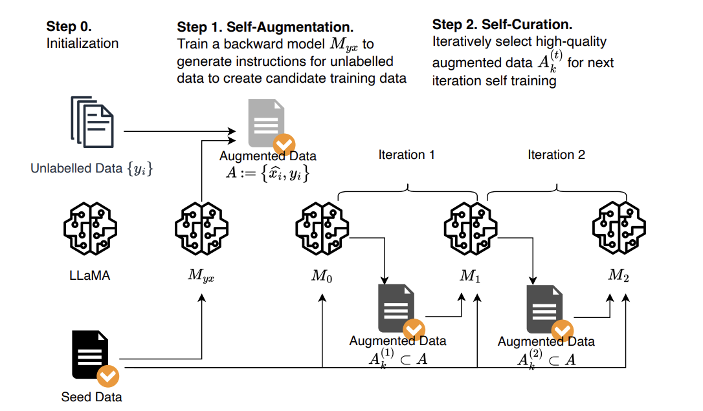

# Self-Alignment with Instruction_Backtranslation

Implementation of [Self-Alignment with Instruction Backtranslation](https://arxiv.org/abs/2308.06259)

## Introduction

While fine-tuning small language models like LLaMA-2 and Mistral-7B is well-established, real-world scenarios often lack annotated data. Moreover, human annotation can be prohibitively expensive. This project explores an innovative approach to overcome these challenges.

## Methodology
The authors of the paper present a scalable method to build a high quality instruction following language model by automatically labelling human-written text with corresponding instructions. The approach, named instruction backtranslation, starts with a language model finetuned on a small amount of seed data, and a given web corpus. The seed model is used to construct training examples by generating instruction prompts for web documents (self-augmentation), and then selecting high quality examples from among these candidates (self-curation). This data is then used to finetune a stronger model. Finetuning LLaMa on two iterations of our approach yields a model that outperforms all other LLaMa-based models on the Alpaca leaderboard not relying on distillation data, demonstrating highly effective self-alignment.

## Solution Overview

## Implementation

### 1. Instruction Backtranslation:
a. Dataset Generation:
* Notebook: [Generate_Backtranslation_dataset](https://github.com/chakraborty-arnab/Instruction_Backtranslation/blob/main/Notebooks/Generate_backtranslation_dataset.ipynb)
* Create a Backtranslation dataset with (Response, Instruction) pairs that we will use to fine-tune our Instruction Backtranslation model.
* Perform pre-processing and filtering on the [openassistant-guanaco](https://huggingface.co/datasets/timdettmers/openassistant-guanaco) dataset to generate the guanaco-llama2-reverse-instruct dataset in the format compatible with the base [Llama-2-7b-chat-hf](https://huggingface.co/meta-llama/Llama-2-7b-chat-hf) model.
* The resulting dataset is uploaded as [guanaco-llama2-reverse-instruct](https://huggingface.co/datasets/Arnab13/guanaco-llama2-reverse-instruct).

b. Model Fine-tuning:
* Notebook: [Instruction_Backtranslation](https://github.com/chakraborty-arnab/Instruction_Backtranslation/blob/main/Notebooks/Instruction_Backtranslation.ipynb)
* Fine-tune the [Llama-2-7b-chat-hf](https://huggingface.co/meta-llama/Llama-2-7b-chat-hf) model using QLoRA on the [guanaco-llama2-reverse-instruct](https://huggingface.co/datasets/Arnab13/guanaco-llama2-reverse-instruct) dataset.
* The resulting model is uploaded as [Llama2-7b-BackInstruct](https://huggingface.co/Arnab13/Llama2-7b-BackInstruct).

### 2. Self-Augmentation
* Notebook: [Self_Augmentation](https://github.com/chakraborty-arnab/Instruction_Backtranslation/blob/main/Notebooks/Self_Augmentation.ipynb)
* Randomly sample a subset of 150 completions from the [LIMA](https://huggingface.co/datasets/GAIR/lima) dataset, filtering out any multi-turn examples.
* Use the [Llama2-7b-BackInstruct](https://huggingface.co/Arnab13/Llama2-7b-BackInstruct) model to generate instructions for the LIMA dataset, mimicking real-world scenarios of generating instructions for a large text corpus.

### 3. Self-Curation
* Notebook: [Self_Curation](https://github.com/chakraborty-arnab/Instruction_Backtranslation/blob/main/Notebooks/Self_Curation.ipynb)
* Use the base [Llama-2-7b-chat-hf](https://huggingface.co/meta-llama/Llama-2-7b-chat-hf) model to rate the generated instruction-completion pairs from the [LIMA](https://huggingface.co/datasets/GAIR/lima) dataset.
* Low-quality results are filtered out to ensure a high-quality dataset.
* The resulting dataset is uploaded as [guanaco-llama2-reverse-instruct](https://huggingface.co/datasets/Arnab13/LIMA-Generated-Instruct-self-curated).

### 4. Self-Alignment
* Notebook: [Self_Alignment](https://github.com/chakraborty-arnab/Instruction_Backtranslation/blob/main/Notebooks/Self_Alignment.ipynb)
* We fine-tune a base [Llama-2-7b-chat-hf](https://huggingface.co/meta-llama/Llama-2-7b-chat-hf) chat model using QLoRA on the [guanaco-llama2-reverse-instruct](https://huggingface.co/datasets/Arnab13/LIMA-Generated-Instruct-self-curated) dataset.
* Based on the experiments and results in the paper, this fine-tuned model outperforms the base LLaMA-2 chat model.

## Combine Workflow:
For users who prefer to run the entire process in a single notebook, a comprehensive notebook has been created that combines all the steps: [End_to_End_Implementation](https://github.com/chakraborty-arnab/Instruction_Backtranslation/blob/main/Notebooks/End_to_End_Implemetation.ipynb)

## Hardware Requirements
To run the notebooks in this project, you will need access to an NVIDIA T4 GPU or equivalent. The fine-tuning and inference processes are computationally intensive and require significant GPU resources. Inadequate GPU resources may result in significantly longer processing times or potential out-of-memory errors.
Notebook can be utilized to run

## Citation
If you use this implementation in your work, please cite the original paper: https://arxiv.org/abs/2308.06259

